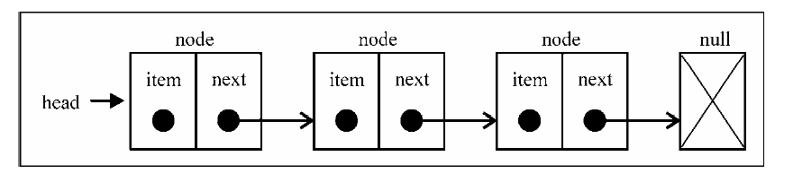

## 理解栈

栈是遵循`后进先出`（LIFO）的`有序`集合。 就像羽毛球的球筒，先放的球在下面，后放的球在上面。栈通常被用于在内存中保存变量和方法调用。

#### 用Javascript实现一个栈
栈通常有下面几个操作：
1. push(element) : 添加新元素到栈顶
2. pop() : 出栈，移除栈顶的元素，同时返回该元素
3. peek(): 返回栈顶元素
4. isEmpty():判断栈是否为空
5. clear(): 清空栈
6. size(): 返回栈里的元素个数

我们用数组来实现栈

```
function Stack(){
    var items = [];
}
```

实现第一个方法 push(element)

```
function Stack(){
    var items = [];

    //入栈
    this.push(element){
        items.push(element);
    }
}
```
利用数组的push方法非常简单就实现了，下面实现pop()方法

```
function Stack(){
    var items = [];

    //入栈
    this.push(element){
        items.push(element);
    }

    //出栈
    this.pop(){
        return items.pop();
    }
}
```

查询栈顶元素：
```
function Stack(){
    var items = [];

    //入栈
    this.push(element){
        items.push(element);
    }

    //出栈
    this.pop(){
        return items.pop();
    }

    // 查询栈顶元素
    this.peek(){
        return items[items.length -1];
    }
}
```

判断栈是否为空
```
function Stack(){
    var items = [];

    //入栈
    this.push(element){
        items.push(element);
    }

    //出栈
    this.pop(){
        return items.pop();
    }

    // 查询栈顶元素
    this.peek(){
        return items[items.length -1];
    }

    // 判断栈是否为空
    this.isEmpty(){
        return items.length == 0;
    }
}
```

下面是清空栈元素和返回栈元素个数
```
function Stack(){
    var items = [];

    //入栈
    this.push = function(element){
        items.push(element);
    }

    //出栈
    this.pop = function(){
        return items.pop();
    }

    // 查询栈顶元素
    this.peek = function(){
        return items[items.length -1];
    }

    // 判断栈是否为空
    this.isEmpty = function(){
        return items.length == 0;
    }

    //清空
    this.clear = function(){
        items = [];
    }

    //返回栈元素个数
    this.size = function(){
        return items.length;
    }

    this.echo = function(){
        console.log(items.toString());
    }
}
```


#### 使用栈

我们现在实现了栈类，下面来测试下

```
var stack = new Stack();
console.log(stack.isEmpty()); //判断是否为空
stack.push(100)
stack.push('abc')
stack.echo();

console.log(stack.peek());
console.log(stack.pop());
console.log(stack.size());

stack.clear();
console.log(stack.size());

```
输出：
```
true
100,abc
abc
abc
1
0
```

下面来看看实际应用场景：

#### 数制间的相互转换：

可以利用栈将一个数字从一种数制转换成另一种数制。假设想将数字 n 转换为以 b 为基数的数字,实现转换的算法如下。

1. 最高位为 n % b,将此位压入栈。  
2. 使用n/b代替n。  
3. 重复步骤 1 和 2,直到 n 等于 0,且没有余数。  
4. 持续将栈内元素弹出,直到栈为空,依次将这些元素排列,就得到转换后数字的字符串形式。  

```
function mulBase(num, base) {
    var s = new Stack();
    do {
        s.push(num % base);
        num = Math.floor(num /= base);
    } while (num > 0);
    var converted = "";
    while (s.size() > 0) {
        converted += s.pop();
    }
    return converted;
}

mulBase(115, 8); // 163
```

下面是题外话，上面算法就是采用除8取余法，余数依次入栈，最后，依次出栈就是所要的结果了。转换其他进制也是同理。
```
十进制化八进制
方法1：采用除8取余法。
例：将十进制数115转化为八进制数
8| 115…… 3
8| 14 …… 6
8| 1 …… 1
结果：（115）10 = （163）8
```

#### 汉诺塔

>有三根杆子A，B，C。A杆上有N个(N>1)穿孔圆盘，盘的尺寸由下到上依次变小。要求按下列规则将所有圆盘移至C杆：
每次只能移动一个圆盘；
大盘不能叠在小盘上面。

可以看看汉诺塔的演示： http://jsfiddle.net/timwzw/S7mYF/embedded/result/

汉诺塔的递归法：
```
function hanoi( n, a, b, c )
{
    if( n > 0 )
    {
        hanoi(n-1,a,c,b);
        //将a柱子的最上面的盘子移到c柱子
        c.push( a.pop() );
        hanoi(n-1,b,a,c);
    }
}

var a = new Stack();
a.push('h');
a.push('k');
a.push('m');

var b = new Stack();
var c = new Stack();
hanoi( 3, a, b, c )
c.echo() // h,k,m
```

##### 理解递归

递归是非常重要和实用的编程思维，理解了才能更好理解其他算法程序，求正整数N的阶乘：
```
function factorial(num){
    if(num<=1)
        return 1;
    return num*factorial(num-1);
}

factorial(5)
```
执行过程如下，往下递增调用，入栈：
```
1
2 * f(1)
3 * f(2)
4 * f(3)
5 * f(4)   
```

往回计算，出栈：
```
1
2 * 1  // f(1) = 1
3 * 2  // f(2) = 2*f(1) = 2
4 * 6  // f(3) = 3*f(2) = 6
5 * 24 // f(4) = 4*f(3) = 24

最终结果是 120
```
所以，递归包含了2个过程，往下递增调用函数，把调用代码入栈，往回出栈计算，递归也是使用了栈的数据结构。

显然，递归的函数调用是通过栈来实现的，所以每次递归的开销，需要不停的进行栈的push和pop操作，这样会耗费大量的空间，也可能会造成冗余运算。


## 理解队列

队列是遵循FIFO(First In First Out)`先进先出`原则的一组`有序`集合。正如排队取票，先进的先取票。

#### 用Javascript实现一个队列

我们同样使用数组来实现队列

```
function Queue(){
    var items = [];
}
```

队列通常有下面几个操作：
1. enQueue(element) : 入队
2. deQueue() : 出队
3. front(): 返回队列第一个元素
4. isEmpty():判断队列是否为空
5. clear(): 清空队列
6. size(): 返回队列里的元素个数

为了简单，直接看最后的代码：
```
function Queue(){
    var items = [];

    // 入队
    this.enQueue = function(element){
        items.push(element)
    }

    // 出队
    this.deQueue = function(element){
        return items.shift(); // 从数组中移除下标为0的元素, 并返回该元素
    }

    // 返回队列第一个元素
    this.front = function(){
        return items[0];
    }

    // 判断队列是否为空
    this.isEmpty = function(){
        return items.length == 0;
    }

    // 返回队列里的元素个数
    this.size = function(){
        return items.length;
    }

    // 清空队列
    this.clear = function(){
        items = [];
    }

    this.echo = function(){
        console.log(items.toString());
    }
}
```


#### 使用队列

下面来测试下队列类
```
var queue = new Queue();
console.log(queue.isEmpty()); //判断是否为空
queue.enQueue(100)
queue.enQueue('abc')
queue.echo();

console.log(queue.size());
queue.clear();
console.log(queue.size());
```

输出：
```
true
100,abc
2
0
```

##### 循环队列 - 击鼓传花

把队列头部元素放到尾部，循环这个过程，类似击鼓传花。

看代码实现：

```
function hotPotato(names, num){
    var queue = new Queue();
    for(var i=0; i<names.length; i++){
        queue.enQueue(names[i]);
    }

    while(queue.size() >1 ){
        for(var j=0; j<num; j++){
            queue.enQueue(queue.deQueue());  // 把队头的元素放到队尾，实现循环
        }
        var outer = queue.deQueue();  // 循环结束，表示停止打鼓了，此时队头的元素就要出队
        console.log(outer+"您已被淘汰");
    }

    var winner = queue.deQueue();  // 只剩下最后一位元素，就是胜出者,出队
    console.log(winner+"胜出");
}

hotPotato(['john','jack','carl'], 5);

```

输出：
```
carl您已被淘汰
jack您已被淘汰
john胜出
```

## 理解链表

上面栈和队列都是基于数组来实现的，数组有个缺点，在开始位置插入成本很高，因为要依次移动后面元素的位置，优点就是查询效率很高，通过下标就可以访问到。

链表存储有序的元素集合，每个元素由一个存储本身的节点和指向下一个元素的引用（内存地址）组成，所以，链表里的元素在内存中不是连续存放的，这点跟数组也不一样，数组的元素在内存中是连续存放的。

因为是链式结构，在任意位置插入元素非常方便，最多只影响到2个元素，但同时，因为元素在内存中不是连续存放的，不能直接用下标来访问元素，必须从第一个元素遍历才能找到指定元素，优点和缺点刚好跟数组相反。



#### 用Javascript实现一个单向链表

下面是单向链表的实现：

```
function LinkedList(){

    // 存储元素的节点，包括元素本身和指向下一个节点的引用
    var Node = function(element){
        this.element = element;
        this.next = null;
    }

    var length = 0;  //存储节点数量
    var head = null; //保存第一个节点的引用

    // 追加，向链表尾部添加元素
    this.append = function(element){
        var node = new Node(element);
        var currNode = null;

        if(head === null){
            // 赋值给第一个节点
            head = node;
        }else{
            currNode = head;
            while(currNode.next){
                // 遍历节点，找到最后一个
                currNode = currNode.next;
            }
            //把最后一个节点的next指向新节点
            currNode.next = node;
        }
        // 更新节点的长度
        length++;
    }

    // 插入，向链表指定位置插入元素
    this.insert = function(position, element){
        if(position>=0 && position < length){
            var node = new Node(element);
            var current = head,
                previous,  // 前一个节点
                index = 0; // 位置，下标

            if(position ===0 ){
                //在第一个位置添加，把新节点的next指向第一个节点，把新节点赋值给head
                node.next = current;
                head = node;
            }else{
                while(index++ < position){
                    previous = current;      // 找到position节点的前一个节点
                    current = current.next;  // 找到position节点
                }

                node.next = current;  // 把新节点的next指向position节点
                previous.next = node; // 把position节点的前一个节点的next指向新节点

            }
            length++;

            return true;
        }else{
            return false;
        }
    }

    // 移除指定位置的元素
    this.removeAt = function(position){
        if(position>=0 && position < length){
            var current = head,
                previous,  // 前一个节点
                index = 0; // 位置，下标

            if(position ===0 ){
                //移除第一项，把head节点的next赋值给head，相当于把第二个节点赋值给head,作为第一个节点
                head = current.next;
            }else{
                while(index++ < position){
                    previous = current;      // 找到position节点的前一个节点
                    current = current.next;  // 找到position节点
                }

                previous.next = current.next; //把position节点的下一个节点跟前一个节点连接起来
            }
            length--;

            return current.element;
        }else{
            return false;
        }
    }

    // 返回元素在链表中的索引
    this.indexOf = function(element){
        var current = head, index = -1;
        while(current){
            index++;
            if(element === current.element){
                return index;
            }
            current = current.next; // 把当前节点的next指向的节点赋值给current, 即把下一个节点作为当前节点
        }
        return -1;
    }

    // 根据元素值移除元素
    this.remove = function(element){
        var index = this.indexOf(element); //找到元素的位置下标
        return this.removeAt(index);       //根据下标移除元素
    }

    // 判断链表是否为空
    this.isEmpty = function(){
        return length === 0;
    }

    // 返回链表元素的个数
    this.size = function(){
        return length;
    }

    this.toString = function(){
        var current = head, str='';
        while(current){
            str += "," + current.element;
            current = current.next;
        }
        console.log(str.slice(1))
    }
}
```

#### 使用单向链表

简单测试下
```
var linkedList = new LinkedList();
linkedList.append('first');
linkedList.append('second');
linkedList.insert(0, 'pre-first');
linkedList.toString();

console.log(linkedList.indexOf('second'));
linkedList.removeAt(1);
linkedList.toString();

linkedList.remove('second');
linkedList.toString();

console.log(linkedList.isEmpty());
console.log(linkedList.size());
```

输出：
```
pre-first,first,second
2
pre-first,second
pre-first
false
1
```

上面主要介绍单向链表，还有双向链表和循环链表，都是在单向链表的基础上增加特性，可以额外延伸学习，这里不作介绍。

http://www.imooc.com/article/4593


## 理解哈希散列
哈希表（Hash table，也叫散列表），是根据关键字（Key value）而直接访问在内存存储位置的数据结构。

哈希表的做法其实很简单，就是把Key通过一个哈希函数转换成一个整型数字，将value存储在以该数字为下标的数组空间里。

实现哈希函数的算法： 把key的每个字符对应的ASCII值相加，然后对任意数取模。
```
function hashCode(key){
    var hash = 0;
    for(var i=0; i<key.length;i++){
        hash += key.charCodeAt(i);
    }
    return hash % 37 ; //　对37取模没有特别的原因，可以换成其他数值
}
```

#### 用Javascript实现一个哈希Hash

直接看代码

```
function HashTable(){
    var table = [];

    this.hashCode = function(key){
        var hash = 0;
        for(var i=0; i<key.length;i++){
            hash += key.charCodeAt(i);
        }
        return hash % 37 ; //　对37取模没有特别的原因，可以换成其他数值
    }

    this.put = function(key, value){
        var position = this.hashCode(key);
        table[position] = value;
    }

    this.get = function(key){
        var position = this.hashCode(key);
        return table[position];
    }

    this.remove = function(key){
        var position = this.hashCode(key);
        table[position] = '';
    }
}
```

#### 使用哈希Hash

简单测试下
```
var hash = new HashTable();
hash.put('abc','hello');
console.log(hash.get('abc'));  // 输出 hello
hash.remove('abc');
console.log(hash.get('abc'));  // 输出 undefined
```


##### 哈希冲突

有些时候，一些key会有相同的哈希值，就是不同的key, 通过上面的hashCode函数返回相同的数值，这就会导致不同的key指向了相同的value，解决冲突的方法有：
1. 分离链接  
2. 线性探查  
3. 双散列法  

减少冲突最好是找到一个更佳的哈希算法，上面3种解决冲突的方法尽管能避免冲突，但是也增加了哈希查找的复杂度，下面是一个更好的哈希算法：

```
function DJBHashCoed(key){
    var hash = 5381; // 初始化为一个质数
    for(var i=0; i<key.length; i++){
        hash = hash * 33 + key.charCodeAt(i); // 质数与33相乘后再与ASCII码相加
    }
    return hash % 1031;  // 对1031取模
}
```

延伸阅读：  
https://www.byvoid.com/zhs/blog/string-hash-compare
