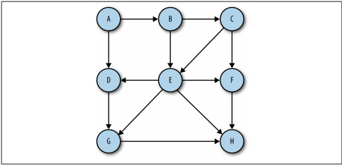
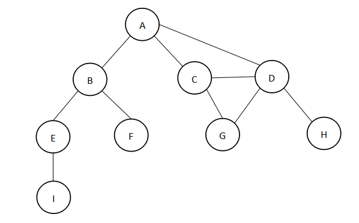
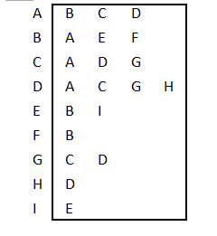
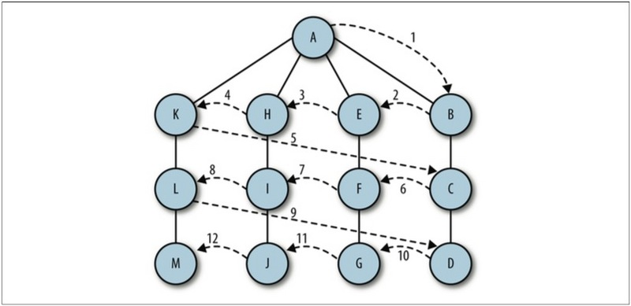
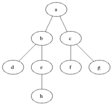
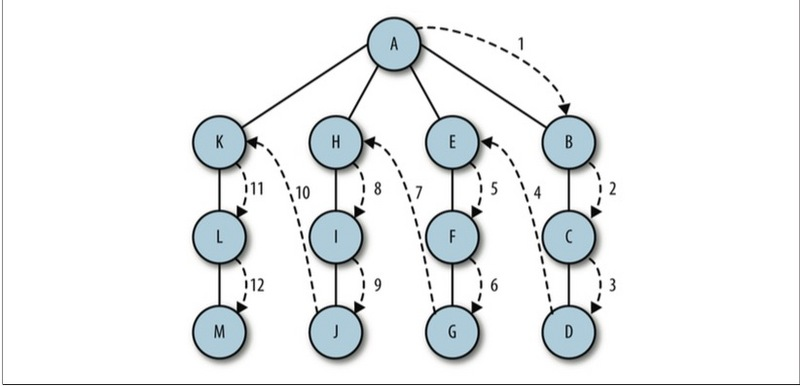

## 理解图和遍历
图（Graph）是由顶点的有穷非空集合和顶点之间边的集合组成，通常表示为：G(V,E)，其中，G表示一个图，V是图G中顶点的集合，E是图G中边的集合。

下面是一个有向图：



### 图的概念
1. 相邻顶点： 由一条边连接在一起的顶点称为相邻顶点；
2. 顶点的度： 是其相邻顶点的数量；
3. 路径：所有顶点都由边连接构成；路径长度为第一个定点到最后一个顶点之间的数量；
4. 环：指向自身的顶点，长度为0；
5. 圈：至少有一条边的路径，且第一个顶点和最后一个顶点相同；
6. 强连通：如果两个顶点之间有路径，则这两个顶点就是强连通

### 图的表示 - 邻接表数组
邻接表由图中每个顶点的相邻顶点列表所组成，比如有下面的图：



我们可以用下面的邻接表数组来表示：



下面是代码实现：

```
function Graph() {
    var vertices = []; //存储图中所有的顶点名字
    var adjList = new Map();//用ES6的Map来存储邻接表
    this.addVertex = function(v){ //添加顶点
        vertices.push(v);
        adjList.set(v, []); //顶点为键，值为空数组
    };
    this.addEdge = function(v, w){ //添加边, v和w形参代表顶点
        adjList.get(v).push(w); //基于有向图，v顶点指向w顶点
        adjList.get(w).push(v); //基于无向图，w顶点指向v顶点
    };
    this.toString = function(){
        var s = '';
        for (var i=0; i<vertices.length; i++){
            s += vertices[i] + ' -> ';
            var neighbors = adjList.get(vertices[i]);
            for (var j=0; j<neighbors.length; j++){
                s += neighbors[j] + ' ';
            }
            s += '\n';
        }
        return s;
    };
}  
//测试
var graph = new Graph();
var myVertices = ['A','B','C','D','E','F','G','H','I'];
for (var i=0; i<myVertices.length; i++){
    graph.addVertex(myVertices[i]);
}
graph.addEdge('A', 'B');
graph.addEdge('A', 'C');
graph.addEdge('A', 'D');
graph.addEdge('C', 'D');
graph.addEdge('C', 'G');
graph.addEdge('D', 'G');
graph.addEdge('D', 'H');
graph.addEdge('B', 'E');
graph.addEdge('B', 'F');
graph.addEdge('E', 'I');
console.log(graph.toString());

```

输出：
```
A -> B C D
B -> A E F
C -> A D G
D -> A C G H
E -> B I
F -> B
G -> C D
H -> D
I -> E
```


### 图的遍历
和树的数据结构类似，我们可以访问图的所有节点。有两种算法可以对图进行遍历：  
1. 广度优先搜索（Breadth-First Search，BFS），基于队列，先进先出
2. 深度优先搜索（Depth-First Search，DFS），基于栈，先进后出

为了保证算法效率，需要对顶点进行标注（着色），下面三种颜色代表对应状态：
1. 白色：表示该顶点还没有被访问。
2. 灰色：表示该顶点被访问过，但并未被探索过，探索是指跟这个顶点的相邻顶点也被访问过。
3. 黑色：表示该顶点被访问过且被完全搜索过，所有的相邻顶点都是灰色了，那么该顶点就可以标注为黑色。


#### 广度优先搜索（BFS）
广度优先搜索算法会从指定的第一个顶点开始遍历图，先访问其所有的相邻点，就像一次访问图的一层。换句话说，就是先宽后深的访问顶点。以下是从顶点v开始的广度优先搜索算法所遵循的步骤。

1. 创建一个队列Q。  
2. 将v标注为被发现的（灰色），并将v入队列Q。  
3. 如果Q非空，则运行以下步骤：  
    3.1 将u从Q中出队列；  
    3.2 将标注u为被发现的（灰色）；  
    3.3 将u所有未被访问过的邻点（白色）入队列；  
    3.4 将u标注为已被探索的（黑色）；  

广度优先搜索如下图：



下面是广度优先搜索的实现：
```
// 广度优先搜索将会用到队列
function Queue(){
    var items = [];

    // 入队
    this.enQueue = function(element){
        items.push(element)
    }

    // 出队
    this.deQueue = function(element){
        return items.shift(); // 从数组中移除下标为0的元素, 并返回该元素
    }

    // 返回队列第一个元素
    this.front = function(){
        return items[0];
    }

    // 判断队列是否为空
    this.isEmpty = function(){
        return items.length == 0;
    }

    // 返回队列里的元素个数
    this.size = function(){
        return items.length;
    }

    // 清空队列
    this.clear = function(){
        items = [];
    }

    this.echo = function(){
        console.log(items.toString());
    }
}

function Graph() {
    var vertices = []; //存储图中所有的顶点名字
    var adjList = new Map();//用ES6的Map来存储邻接表

    this.addVertex = function(v){ //添加顶点
        vertices.push(v);
        adjList.set(v, []); //顶点为键，值为空数组
    };

    this.addEdge = function(v, w){ //添加边, v和w形参代表顶点
        adjList.get(v).push(w); //基于有向图，v顶点指向w顶点
        adjList.get(w).push(v); //基于无向图，w顶点指向v顶点
    };

    this.initializeColor = function(){
      var color = [];
      for (var i=0; i<vertices.length; i++){
          color[vertices[i]] = 'white'; //初始化所有的顶点都是白色
      }
      return color;
    };

    // 广度优先搜索图
    this.bfs = function(v, callback){
      var color = this.initializeColor(),
          queue = new Queue(); //创建一个队列
      queue.enQueue(v); //入队列
      while (!queue.isEmpty()){
          var u = queue.deQueue(), //出队列
              neighbors = adjList.get(u); //邻接表
          color[u] = 'grey'; //发现了但还未完成对其的搜素
          for (var i=0; i<neighbors.length; i++){
              var w = neighbors[i]; //顶点名
              if (color[w] === 'white'){
                  color[w] = 'grey'; //发现了它
                  queue.enQueue(w); //入队列循环
              }
          }
          color[u] = 'black'; //已搜索过
          if (callback) {
              callback(u);
          }
      }
    };

    this.toString = function(){
        var s = '';
        for (var i=0; i<vertices.length; i++){
            s += vertices[i] + ' -> ';
            var neighbors = adjList.get(vertices[i]);
            for (var j=0; j<neighbors.length; j++){
                s += neighbors[j] + ' ';
            }
            s += '\n';
        }
        return s;
    };
}  
//测试
var graph = new Graph();
var myVertices = ['A','B','C','D','E','F','G','H','I'];
for (var i=0; i<myVertices.length; i++){
    graph.addVertex(myVertices[i]);
}
graph.addEdge('A', 'B');
graph.addEdge('A', 'C');
graph.addEdge('A', 'D');
graph.addEdge('C', 'D');
graph.addEdge('C', 'G');
graph.addEdge('D', 'G');
graph.addEdge('D', 'H');
graph.addEdge('B', 'E');
graph.addEdge('B', 'F');
graph.addEdge('E', 'I');

//测试如下：
function printNode(value){
    console.log('Visited vertex: ' + value);
}
graph.bfs(myVertices[0], printNode);

结果如下：
Visited vertex: A
Visited vertex: B
Visited vertex: C
Visited vertex: D
Visited vertex: E
Visited vertex: F
Visited vertex: G
Visited vertex: H
Visited vertex: I
```

下面是动画演示：  



##### 用BFS寻找最短路径

修改上面的BFS算法，根据源顶点到每个邻接顶点的距离来判断路径的长短。

```
// 广度优先搜索将会用到队列
function Queue(){
    var items = [];

    // 入队
    this.enQueue = function(element){
        items.push(element)
    }

    // 出队
    this.deQueue = function(element){
        return items.shift(); // 从数组中移除下标为0的元素, 并返回该元素
    }

    // 返回队列第一个元素
    this.front = function(){
        return items[0];
    }

    // 判断队列是否为空
    this.isEmpty = function(){
        return items.length == 0;
    }

    // 返回队列里的元素个数
    this.size = function(){
        return items.length;
    }

    // 清空队列
    this.clear = function(){
        items = [];
    }

    this.echo = function(){
        console.log(items.toString());
    }
}

// 输出最短路径时候需要用到栈
function Stack(){
    var items = [];

    //入栈
    this.push = function(element){
        items.push(element);
    }

    //出栈
    this.pop = function(){
        return items.pop();
    }

    // 查询栈顶元素
    this.peek = function(){
        return items[items.length -1];
    }

    // 判断栈是否为空
    this.isEmpty = function(){
        return items.length == 0;
    }

    //清空
    this.clear = function(){
        items = [];
    }

    //返回栈元素个数
    this.size = function(){
        return items.length;
    }

    this.echo = function(){
        console.log(items.toString());
    }
}

function Graph() {
    var vertices = []; //存储图中所有的顶点名字
    var adjList = new Map();//用ES6的Map来存储邻接表

    this.addVertex = function(v){ //添加顶点
        vertices.push(v);
        adjList.set(v, []); //顶点为键，值为空数组
    };

    this.addEdge = function(v, w){ //添加边, v和w形参代表顶点
        adjList.get(v).push(w); //基于有向图，v顶点指向w顶点
        adjList.get(w).push(v); //基于无向图，w顶点指向v顶点
    };

    this.initializeColor = function(){
      var color = [];
      for (var i=0; i<vertices.length; i++){
          color[vertices[i]] = 'white'; //初始化所有的顶点都是白色
      }
      return color;
    };

    // 广度优先搜索图，最短路径
    this.bfs = function(v){
      var color = this.initializeColor(),
          queue = new Queue(); //创建一个队列
          d = [] , // 表示距离，比如：从顶点v到顶点u的距离，d[u]
          pred = []; //表示前溯点（类似树的父节点）,
      queue.enQueue(v); //入队列

      //初始化每个顶点的距离和前溯点
      for(var i=0; i<vertices.length; i++){
          d[vertices[i]] = 0;
          pred[vertices[i]] = null;
      }

      while (!queue.isEmpty()){
          var u = queue.deQueue(), //出队列
              neighbors = adjList.get(u); //邻接表
          color[u] = 'grey'; //发现了但还未完成对其的搜素
          for (var i=0; i<neighbors.length; i++){
              var w = neighbors[i]; //顶点名
              if (color[w] === 'white'){
                  color[w] = 'grey'; //发现了它

                  d[w] = d[u] + 1; // 关键点，顶点u是顶点w的前溯点，那么顶点w的距离就是顶点u的距离加1；
                  pred[w] = u;

                  queue.enQueue(w); //入队列循环
              }
          }
          color[u] = 'black'; //已搜索过
      }
      return {
          distances:d,
          pred : pred
      }
    };

    // 输出最短路径
    this.showPath = function(myVertices, shortestPath){
        var formVertex = myVertices[0];
        for(var i=1; i<myVertices.length; i++){
            var toVertex = myVertices[i], path = new Stack();
            for(var v=toVertex; v!==formVertex;v=shortestPath.pred[v]){
                path.push(v);
            }
            path.push(formVertex);
            var s= path.pop();
            while(!path.isEmpty()){
                s += '-' + path.pop();
            }
            console.log(s);
        }
    }

    this.toString = function(){
        var s = '';
        for (var i=0; i<vertices.length; i++){
            s += vertices[i] + ' -> ';
            var neighbors = adjList.get(vertices[i]);
            for (var j=0; j<neighbors.length; j++){
                s += neighbors[j] + ' ';
            }
            s += '\n';
        }
        return s;
    };
}  
//测试
var graph = new Graph();
var myVertices = ['A','B','C','D','E','F','G','H','I'];
for (var i=0; i<myVertices.length; i++){
    graph.addVertex(myVertices[i]);
}
graph.addEdge('A', 'B');
graph.addEdge('A', 'C');
graph.addEdge('A', 'D');
graph.addEdge('C', 'D');
graph.addEdge('C', 'G');
graph.addEdge('D', 'G');
graph.addEdge('D', 'H');
graph.addEdge('B', 'E');
graph.addEdge('B', 'F');
graph.addEdge('E', 'I');

//测试如下：
var data = graph.bfs(myVertices[0]);

graph.showPath(myVertices, data);


输出结果：
A-B
A-C
A-D
A-B-E
A-B-F
A-C-G
A-D-H
A-B-E-I
```

本例介绍的图不是加权图，比如要计算城市A和城市B的最短路径，广度优先搜索算法并不合适。

解决最短路径的算法有很多，比如：  
Dijkstra's算法解决了单源最短路径问题。  
Bellman-Ford算法解决了边全值为负的单源最短路径问题。  
A*搜索算法解决了求仅一对顶点间的最短路径问题。  
Floyd-Warshall算法解决了求所有顶点间的最短路径问题。  

如果感兴趣可以研究下，这里不作介绍。

#### 深度优先搜索（DFS）

深度优先搜索算法是从第一个顶点开始遍历图，沿着路径直到这条路径的最后一个顶点被访问，接着原路回退并探索下一条路径，简单地说，是先深度后广度的访问节点，如下图：  



遍历步骤：
1. 从图中某个顶点v出发，访问v；然后找到v的一个邻接顶点w ；
2. 从w出发，深度优先搜索访问和w相邻接且未被访问的所有顶点；
3. 重复第一步和第二步 ，直到和v相邻接的所有顶点都被访问为止；
4. 继续选取图中未被访问顶点作为起始顶点，重复上面步骤，直到图中所有顶点都被访问为止。

可以看出来，深度优先搜索的步骤是递归的，所以，我们可以用递归的方式来实现，而递归需要用到栈。

下面是代码实现：

```
// 输出最短路径时候需要用到栈
function Stack(){
    var items = [];

    //入栈
    this.push = function(element){
        items.push(element);
    }

    //出栈
    this.pop = function(){
        return items.pop();
    }

    // 查询栈顶元素
    this.peek = function(){
        return items[items.length -1];
    }

    // 判断栈是否为空
    this.isEmpty = function(){
        return items.length == 0;
    }

    //清空
    this.clear = function(){
        items = [];
    }

    //返回栈元素个数
    this.size = function(){
        return items.length;
    }

    this.echo = function(){
        console.log(items.toString());
    }
}

function Graph() {
    var vertices = []; //存储图中所有的顶点名字
    var adjList = new Map();//用ES6的Map来存储邻接表

    this.addVertex = function(v){ //添加顶点
        vertices.push(v);
        adjList.set(v, []); //顶点为键，值为空数组
    };

    this.addEdge = function(v, w){ //添加边, v和w形参代表顶点
        adjList.get(v).push(w); //基于有向图，v顶点指向w顶点
        adjList.get(w).push(v); //基于无向图，w顶点指向v顶点
    };

    this.initializeColor = function(){
      var color = [];
      for (var i=0; i<vertices.length; i++){
          color[vertices[i]] = 'white'; //初始化所有的顶点都是白色
      }
      return color;
    };

    //深度优先搜索
    this.dfs = function(callback){
        var color = this.initializeColor(); //前面的颜色数组
        for (var i=0; i<vertices.length; i++){
            if (color[vertices[i]] === 'white'){
                this.dfsVisit(vertices[i], color, callback); //递归调用未被访问过的顶点
            }
        }
    };

    // 递归访问
    this.dfsVisit = function(u, color, callback){
        color[u] = 'grey';
        if (callback) {
            callback(u);
        }
        var neighbors = adjList.get(u); //邻接顶点
        for (var i=0; i<neighbors.length; i++){
            var w = neighbors[i];
            if (color[w] === 'white'){
                this.dfsVisit(w, color, callback); //添加顶点w入栈
            }
        }
        color[u] = 'black';
    }

    this.toString = function(){
        var s = '';
        for (var i=0; i<vertices.length; i++){
            s += vertices[i] + ' -> ';
            var neighbors = adjList.get(vertices[i]);
            for (var j=0; j<neighbors.length; j++){
                s += neighbors[j] + ' ';
            }
            s += '\n';
        }
        return s;
    };
}  
//测试
var graph = new Graph();
var myVertices = ['A','B','C','D','E','F','G','H','I'];
for (var i=0; i<myVertices.length; i++){
    graph.addVertex(myVertices[i]);
}
graph.addEdge('A', 'B');
graph.addEdge('A', 'C');
graph.addEdge('A', 'D');
graph.addEdge('C', 'D');
graph.addEdge('C', 'G');
graph.addEdge('D', 'G');
graph.addEdge('D', 'H');
graph.addEdge('B', 'E');
graph.addEdge('B', 'F');
graph.addEdge('E', 'I');

//测试如下：

//测试如下：
function printNode(value){
    console.log('Visited vertex: ' + value);
}
graph.dfs(printNode);
```

输出：
```
Visited vertex: A
Visited vertex: B
Visited vertex: E
Visited vertex: I
Visited vertex: F
Visited vertex: C
Visited vertex: D
Visited vertex: G
Visited vertex: H
```
