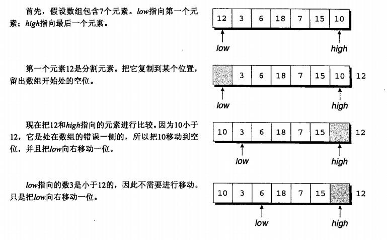
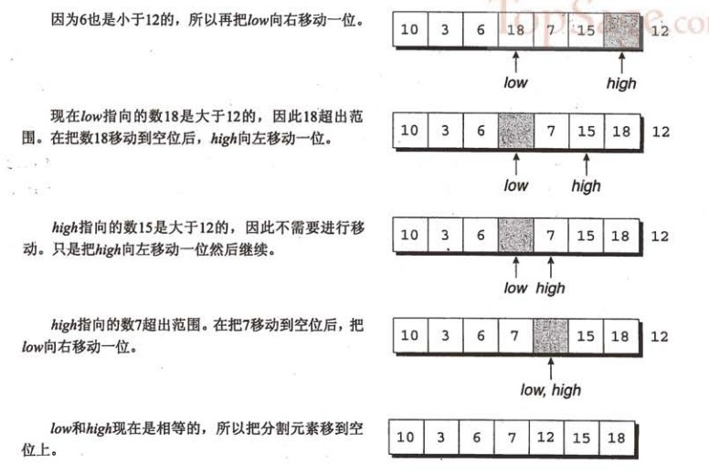

##  理解排序算法

### 基本概念

#### 稳定性
1. 稳定：如果 a 原本在 b 前面，而 a = b，排序之后 a 仍然在 b 的前面；  
2. 不稳定：如果 a 原本在 b 的前面，而 a = b，排序之后 a 可能会出现在 b 的后面；

#### 排序方式
1. 内排序：所有排序操作都在内存中完成，占用常数内存，不占用额外内存。  
2. 外排序：由于数据太大，因此把数据放在磁盘中，而排序通过磁盘和内存的数据传输才能进行，占用额外内存。  

#### 复杂度
1. 时间复杂度: 一个算法执行所耗费的时间，CPU运算时间。
2. 空间复杂度: 运行完一个程序所需内存的大小。


下面是根据排序算法的排序方式的分类：

| 分类         | 排序算法    |
| :------------| :------------- |
| 交换排序      | 冒泡排序，快速排序  |
| 选择排序      | 选择排序，堆排序  |
| 插入排序      | 插入排序，希尔排序  |
| 归并排序      | 归并排序  |
| 分布排序      | 计数排序，桶排序，基数排序  |


下面先来看看各种排序算法的对比：

名词解释： n : 数据规模， k : 桶的个数

| 排序算法      | 平均时间复杂度  | 最好情况       | 最坏情况        | 空间复杂度      | 排序方式  | 稳定性  |
| :------------| :------------- | :------------- | :------------- | :------------- | :------- | :----- |
| 冒泡排序      | O(n2)          | O(n)           |  O(n2)         | O(1)           | 内排序   | 稳定    |
| 选择排序      | O(n2)          | O(n2)          |  O(n2)         | O(1)           | 内排序   | 不稳定    |
| 插入排序      | O(n2)          | O(n)           |  O(n2)         | O(1)           | 内排序   | 稳定    |
| 希尔排序      | O(nlogn)       | O(n(log22n))   |  O(n(log22n))  | O(1)           | 内排序   | 不稳定    |
| 归并排序      | O(nlogn)       | O(nlogn)       |  O(nlogn)      | O(n)           | 外排序   | 稳定    |
| 快速排序      | O(nlogn)       | O(nlogn)       |  O(n2)         | O(logn)        | 内排序   | 不稳定    |
| 堆排序        | O(nlogn)       | O(nlogn)       |  O(nlogn)      | O(1)           | 内排序   | 不稳定    |
| 计数排序      | O(n+k)         | O(n+k)         |  O(n+k)        | O(1)           | 外排序   | 稳定    |
| 桶排序        | O(n+k)         | O(n+k)         |  O(n2)         | O(n+k)         | 外排序   | 稳定    |
| 基数排序	    | O(n×k)         | O(n×k)         |  O(n×k)        | O(n+k)         | 外排序   | 稳定    |


### 冒泡排序

冒泡排序比较任何两个相邻的项，如果第一个项比第二个大，则交换它们。元素向上移动至正确的顺序，就好像气泡升至表面一样，冒泡排序因此得名。

图解如下：


具体算法描述如下：  
1. 比较相邻的元素。如果第一个比第二个大，就交换它们两个；  
2. 对每一对相邻元素作同样的工作，从开始第一对到结尾的最后一对，这样在最后的元素应该会是最大的数；  
3. 针对所有的元素重复以上的步骤，除了最后一个；  
4. 重复步骤 1 31 3，直到排序完成。  


```
function ArrayList(){
    var array = [];
    this.insert = function(item){
        array.push(item);
    };
    // 常规的冒泡排序
    this.bubbleSort = function(){
        var length = array.length;
        for (var i=0; i<length; i++){
            for (var j=0; j<length-1; j++ ){ // 内循环迭代至倒数第二位，为了跟最后一位做交换
                if (array[j] > array[j+1]){
                    swap(j, j+1); // 交换值
                }
            }
        }
    };
    // 交换值
    var swap = function(index1, index2){
        var aux = array[index1];
        array[index1] = array[index2];
        array[index2] = aux;
    };

    this.toString = function(){
        return array.join();
    };
}

var list = new ArrayList()

// 10,9,8,7,6,5,4,3,2,1
for(var i=10; i>0; i--){
    list.insert(i);
}

list.bubbleSort();
console.log(list.toString());

输出结果：
1,2,3,4,5,6,7,8,9,10

```

上面常规冒泡算法，外循环仅仅作为循环结束的条件，意味着内循环不管怎么比较，外循环都会循环N次（N为数组长度），其实，每一轮内循环结束后，对应的外循环下标元素也就确定了，后续的内循环完全没有必要再去比较，比如第一轮外循环i=0, list[0]=10, 内循环结束后，10被交换到最后一位，此时已经确定了10的位置了，下一轮外循环（里的内循环）就没必要再跟10比较了。

下面是改进后的冒泡算法

```
function ArrayList(){
    var array = [];
    this.insert = function(item){
        array.push(item);
    };
    // 常规的冒泡排序
    this.bubbleSort = function(){
        var length = array.length;
        for (var i=0; i<length; i++){
            for (var j=0; j<length-1; j++ ){ // 内循环迭代至倒数第二位，为了跟最后一位做交换
                if (array[j] > array[j+1]){
                    swap(j, j+1); // 交换值
                }
            }
        }
    };
    // 交换值
    var swap = function(index1, index2){
        var aux = array[index1];
        array[index1] = array[index2];
        array[index2] = aux;
    };

    this.toString = function(){
        return array.join();
    };

    //改进后的冒泡排序，避免内循环不必要的比较
    this.modifiedBubbleSort = function(){
        var length = array.length;
        for (var i=0; i<length; i++){
            for (var j=0; j<length-1-i; j++ ){ //减去最后一个已经排好序的位置，上一轮的外循环i下标元素已确定位置了，没必要再比较
                if (array[j] > array[j+1]){
                    swap(j, j+1);
                }
            }
        }
    };        
}

var list = new ArrayList()

// 10,9,8,7,6,5,4,3,2,1
for(var i=10; i>0; i--){
    list.insert(i);
}

list.modifiedBubbleSort();
console.log(list.toString());

输出结果：
1,2,3,4,5,6,7,8,9,10
```

冒泡排序的时间复杂度最坏情况下是O(n2)，性能最差的排序算法之一。


### 选择排序
选择排序算法是一种原址比较排序算法（内排序）。选择排序大致的思路是找到数据结构中的最小值并将其放在第一位，接着找到第二小的值并将其放在第二位，以此类推。

图解如下：


```
function ArrayList(){
    var array = [];
    this.insert = function(item){
        array.push(item);
    };

    // 选择排序
    this.selectionSort = function(){
        var length = array.length,
            indexMin;
        for (var i=0; i<length-1; i++){
            indexMin = i;
            for (var j=i; j<length; j++){ // 内循环记录array[i]后面最小的index位置
                if(array[indexMin]>array[j]){
                    indexMin = j;  // 把值小的下标给indexMin，直到循环结束，indexMin就是最小值的下标了
                }
            }
            if (i !== indexMin){ // 如果最小值的下标不等于当前元素的下标，交换
                swap(i, indexMin);
            }
        }
    };
    // 交换值
    var swap = function(index1, index2){
        var aux = array[index1];
        array[index1] = array[index2];
        array[index2] = aux;
    };

    this.toString = function(){
        return array.join();
    };
}

var list = new ArrayList()

// 10,9,8,7,6,5,4,3,2,1
for(var i=10; i>0; i--){
    list.insert(i);
}

list.selectionSort();
console.log(list.toString());

输出结果：
1,2,3,4,5,6,7,8,9,10
```

选择排序每次交换一对元素，它们当中至少有一个将被移到其最终位置上，因此对 n 个元素的表进行排序总共进行至多 n−1 次交换。在所有的完全依靠交换去移动元素的排序方法中，选择排序属于非常好的一种，但时间复杂度是O(n2)，排序性能依然较差，但原地操作几乎是选择排序的唯一优点，节省空间。

### 插入排序
插入排序每次排一个数组项，假定第一项已经排好序了（假设第一项是最大值），接着，它和第二项进行比较，如果第一项比第二项大，交换位置，保证最小值排在前面，则待在原位，否则插入到第一项之前，以此类推。

图解如下:


插入排序的特点： 需要反复把已排序元素逐步向后挪位，为最新元素提供插入空间。

```
function ArrayList(){
    var array = [];
    this.insert = function(item){
     array.push(item);
    };

    // 插入排序
    this.insertionSort = function(){
      var length = array.length,
          j, temp;
      for (var i=1; i<length; i++){ //假设第一个位置已经排好位置了，从第二位开始
          j = i;
          temp = array[i];  
          while (j>0 && array[j-1] > temp){ //数组前面的比temp大
              array[j] = array[j-1]; //把前一个位置的值给当前位置，交换值，比如 10,9,8, 交换后变成，9，10，8
              j--; // 游标减一，往数组前面移动
          }
          array[j] = temp;  // 比如 10,9,8 ,第一轮循环后，变成 9,10,8, 第二轮循环后交换过程是： 9,8,10 => 8,9,10
      }
    };

    this.toString = function(){
     return array.join();
    };
}

var list = new ArrayList()

// 10,9,8,7,6,5,4,3,2,1
for(var i=10; i>0; i--){     
    list.insert(i);
}

list.insertionSort();
console.log(list.toString());

输出结果：
1,2,3,4,5,6,7,8,9,10
```

插入排序依然要循环2次，时间复杂度最差情况是O(n2)，排序性能依然较差。


### 归并排序
归并排序是第一个可以被实际使用的排序算法，前面的三个排序算法的时间复杂度度为O（n²），但是这个归并排序性能不错，其时间复杂度为O（nlogⁿ）。归并排序是一种分治算法。其思想是将原始数组切分成较小的数组，直到每个小数组只有一个位置，接着将小数组归并成较大的数组，直到最后只有一个排序完毕的大数组。

图解如下：


具体算法描述如下：  
1. 把长度为 n 的输入序列分成两个长度为 n/2 的子序列；  
2. 对这两个子序列分别采用归并排序（递归）；  
3. 将两个排序好的子序列合并成一个最终的排序序列。  


```
function ArrayList(){
    var array = [];
    this.insert = function(item){
     array.push(item);
    };

    //归并排序
    this.mergeSort = function(){
        array = this.mergeSortRec(array);
    };

    this.mergeSortRec = function(array){
        var length = array.length;
        if(length === 1) { //切割数组直到只有一个元素
            return array;
        }
        var mid = Math.floor(length / 2), //分层两边，左和右
            left = array.slice(0, mid),
            right = array.slice(mid, length);
        return this.merge(this.mergeSortRec(left), this.mergeSortRec(right)); //递归完成子序列的归并排序，最后合并在一起，这也是归并排序的算法特征
    };

    this.merge = function(left, right){
        var result = [],
            il = 0,
            ir = 0;
        while(il < left.length && ir < right.length) { //决定是谁先入数组，小的先入
            if(left[il] < right[ir]) {
                result.push(left[il++]);
            } else{
                result.push(right[ir++]);
            }
        }
        while (il < left.length){ //大的后入
            result.push(left[il++]);
        }
        while (ir < right.length){ //大的后入
            result.push(right[ir++]);
        }
        return result;
    };

    this.toString = function(){
     return array.join();
    };
}

var list = new ArrayList()

// 10,9,8,7,6,5,4,3,2,1
for(var i=10; i>0; i--){     
    list.insert(i);
}

list.mergeSort();
console.log(list.toString());

输出结果：
1,2,3,4,5,6,7,8,9,10
```


归并排序算法的时间复杂度是O(nlogⁿ)，利用递归来避免多次循环。


### 快速排序

快速排序也许是最常用的排序算法了，它的时间复杂度为O(nlogⁿ)，且它的性能通常比其他的复杂度O(nlogⁿ)的排序算法要好。和归并排序一样，快速排序也使用分治的方法，将原始数组分为较小的数组（但它没有像归并排序那样将他们分割开）。

图解如下：

  


快速排序使用分治法来把一个串（list）分为两个子串（sub-lists），具体算法描述如下：  
1. 从数列中挑出一个元素，称为 “基准”（pivot）；  
2. 重新排序数列，所有元素比基准值小的摆放在基准前面，所有元素比基准值大的摆在基准的后面（相同的数可以到任一边，这也是快速排序不稳定的原因）。在这个分区退出之后，该基准就处于数列的中间位置。这个称为分区（partition）操作；  
3. 递归地（recursive）把小于基准值元素的子数列和大于基准值元素的子数列排序。  

```
function ArrayList(){
    var array = [];
    this.insert = function(item){
     array.push(item);
    };

    this.quickSort = function(){
         this.quick(array,  0, array.length - 1);
    };

    this.quick = function(array, left, right){
         var index; //用来将子数组分离为较小值数组和较大值数组
         if (array.length > 1) {
             index = this.partition(array, left, right); //划分数组
             if (left < index - 1) { //如果子数组存在较小值的元素,递归
                 this.quick(array, left, index - 1);
             }
             if (index < right) { //如果子数组存在较大值的元素,递归
                 this.quick(array, index, right);
             }
         }
         return array;
    };

    this.partition = function(array, left, right) {
         var pivot = array[Math.floor((right + left) / 2)], //选择一个中间值
             i = left,
             j = right;
         while (i <= j) {
             while (array[i] < pivot) { //移动指针直到找到一个元素比中间值大
                 i++;
             }
             while (array[j] > pivot) { //移动指针直到找到一个元素比中间值小
                 j--;
             }
             if (i <= j) { //左项比右项大，交换后同时移动两个指针
                 this.swapQuickStort(array, i, j);
                 i++;
                 j--;
             }
         }
         return i;
    };

    this.swapQuickStort = function(array, index1, index2){
         var aux = array[index1];
         array[index1] = array[index2];
         array[index2] = aux;
   };

   this.toString = function(){
    return array.join();
   };
}

var list = new ArrayList()

// 10,9,8,7,6,5,4,3,2,1
for(var i=10; i>0; i--){     
list.insert(i);
}

list.quickSort();
console.log(list.toString());

输出结果：
1,2,3,4,5,6,7,8,9,10
```

还有另一种实现：

```
'use strict'
const quickSort = (arr) => {
    if (arr.length <= 1) { return arr; }
    let pivotIndex = Math.floor(arr.length / 2);
    let pivot = arr.splice(pivotIndex, 1)[0];
    let left = [];
    let right = [];
    for (let i = 0; i < arr.length; i++){
    　　if (arr[i] < pivot) {
    　　　　left.push(arr[i]);
    　　} else {
    　　　　right.push(arr[i]);
    　　}
    }
    return quickSort(left).concat([pivot], quickSort(right));  // 尾调用递归
};
let arr=[3,44,38,5,47,15,36,26,27,2,46,4,19,50,48];
console.time('快速排序耗时');
console.log(quickSort(arr));
console.timeEnd('快速排序耗时');

输出结果：
[2, 3, 4, 5, 15, 19, 26, 27, 36, 38, 44, 46, 47, 48, 50]

```


#### 快速排序分步解说
快速排序比较复杂，下面通过分步解说，帮助更好理解算法的原理




此时，我们已经实现了目标：分割元素左侧的所有元素都小于或等于12，而其右侧的所有元素都大于或等于12.

既然已经分割了数组，那么可以使用快速排序算法对数组的前4个元素（10、3、6、7）和后2个元素（15、18）进行递归快速排序了。


Array.prototype.sort 排序，不同浏览器实现算法不一样，Chrome V8是采用快速排序，Firefox采用的是归并排序，Microsoft Edge主要是以快速排序为主。


### 延伸阅读
[堆排序](http://bubkoo.com/2014/01/14/sort-algorithm/heap-sort/)  
[桶排序](http://blog.fens.me/algorithm-bucketsort-nodejs/),  [桶排序](http://bubkoo.com/2014/01/15/sort-algorithm/bucket-sort/)  
[鸡尾酒排序](http://bubkoo.com/2014/01/15/sort-algorithm/shaker-sort/)  
[希尔排序](http://bubkoo.com/2014/01/15/sort-algorithm/shell-sort/)  

日本程序员 norahiko，写了一个排序算法的[动画演示](http://jsdo.it/norahiko/oxIy/fullscreen) ，可以切换不同算法，直观感受下不同算法的排序性能。

参考：
http://www.qcyoung.com/2016/12/18/JavaScript%20%E6%8E%92%E5%BA%8F%E7%AE%97%E6%B3%95%E6%B1%87%E6%80%BB/
