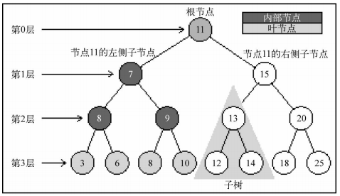
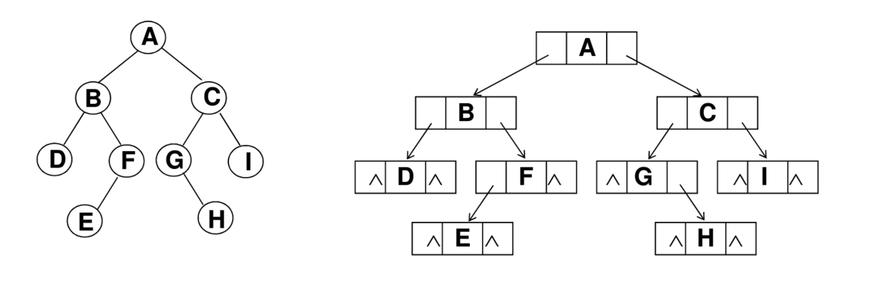
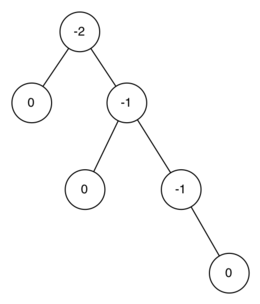
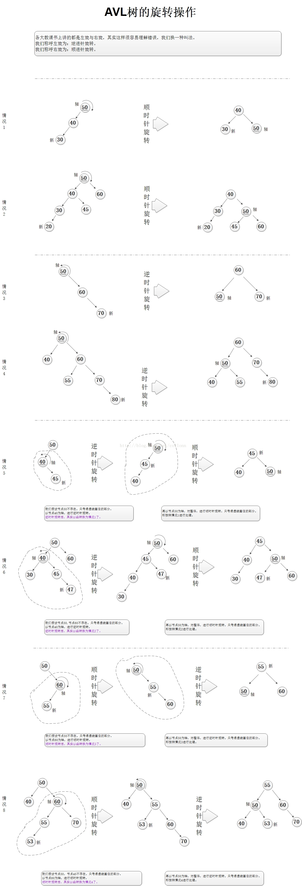

## 理解二叉搜索树BST，自平衡二叉树AVL，红黑树

### 二叉搜索树BST

像栈，队列，链表都是顺序数据结构，哈希表和树是非顺序数据结构。树是一种分层数据的抽象模型，存储需要快速查找的数据非常有用。

#### 了解树的术语

* 树的定义： 一个树结构包含一系列存在父子关系的节点，除根节点外，每个节点都有一个父节点。
* 叶节点：没有子节点的都是叶子节点
* 子树：子树由节点和它的后代构成。
* 节点的深度：节点的深度取决于它的祖先节点的数量
* 树的高度：树的高度取决于所有节点深度的最大值
* 键：键是树相关术语中对节点的称号，下面说键就是指节点

如下图：


#### 二叉树和二叉搜索树(BinarySearchTree)
二叉树是每个节点最多只有两个子节点，而二叉搜索树是特殊的二叉树，要求右侧子节点存储比父节点大的值，左侧子节点存储比父节点小的值，这个特性对快速查找数据非常有用。


#### 用Javascript实现二叉搜索树

二叉搜索树的结构图如下：


代码：
```
function BST(){
    var Node = function(key){
        this.key = key;
        this.left = null;  // 指向左侧子节点
        this.right = null; // 指向右侧子节点
    }

    var root = null; // 根节点
}
```

和双向链表一样，每个节点包含2个指针，分别指向左右两侧子节点。

二叉搜索树需要实现下面方法：  
1. insert(key): 向树中插入新键  
2. search(key): 查找一个键，存在返回true,否则false  
3. min(): 返回树中最小的键值  
4. max()：返回树中最大的键值  

下面是实现后的代码：

```
function BST(){
    var Node = function(key){
        this.key = key;
        this.left = null;  // 指向左侧子节点
        this.right = null; // 指向右侧子节点
    }

    var root = null; // 根节点

    this.insert = function(key){
        var newNode = new Node(key);
        if(root === null){
            root = newNode;
        }else{
            this.inserNode(root, newNode);
        }
    }

    this.inserNode = function(node, newNode){
        //新节点的值比父节点值小，左子节点
        if(newNode.key < node.key){
            //是叶子节点，插入
            if(node.left === null){
                node.left = newNode;
            }else{
                //非叶子节点，递归
                this.inserNode(node.left, newNode);
            }
        }else{
            // 右子节点
            if(node.right === null){
                node.right = newNode;
            }else{
                this.inserNode(node.right, newNode);
            }
        }
    }

    this.min = function(){
        var node = root;
        if(node){
            while(node && node.left !== null){
                node = node.left; //一直找到最左侧的叶子节点
            }
            return node.key;
        }
        return null;
    }

    this.max = function(){
        var node = root;
        if(node){
            while(node && node.right !== null){
                node = node.right;  //一直找到最右侧的叶子节点
            }
            return node.key;
        }
        return null;
    }

    this.search = function(key){
        return this.searchNode(root, key);
    }

    this.searchNode = function(node, key){
        if(node === null){
            return false;
        }

        if(key < node.key){
            //递归查找左侧子节点
            return this.searchNode(node.left, key);
        }else if(key > node.key){
            //递归查找右侧子节点
            return this.searchNode(node.right, key);
        }else{
            return true;
        }
    }

    this.toString = function(){
        var current = root;
        //输出根节点
        this.showNode(current);

        var leftNode = current.left;
        var rightNode = current.right;

        while(leftNode.left){
            this.showNode(leftNode);
            leftNode = leftNode.left;
        }

        while(rightNode.right){
            this.showNode(rightNode);
            rightNode = rightNode.right;
        }
    }

    this.showNode = function(node){
        console.log("父节点："+ node.key + "，它的左右字节点："+node.left.key+","+node.right.key);
    }
}
```

我们来测试下：

```
var bst = new BST();
bst.insert(11);
bst.insert(7);
bst.insert(3);
bst.insert(9);
bst.insert(15);
bst.insert(13);
bst.insert(20);

bst.toString();

console.log(bst.min());
console.log(bst.max());
console.log(bst.search(15));
console.log(bst.search(100));
```

输出：
```
父节点：11，它的左右字节点：7,15
父节点：7，它的左右字节点：3,9
父节点：15，它的左右字节点：13,20
3
20
true
false
```

我们已经实现了二叉搜索树的数据结构，但BST存在一个问题： 添加的节点数越多，树的一边高度可能非常深，另一边可能比较浅，不均衡，会影响查找性能，seache和insert操作会使二叉搜索树的性能降低到O(n)，n为树的高度，换句话讲，假设不平衡树的高度是10，那么把它变成平衡树，高度必然减少，时间复杂度就较低了。




下面会介绍一种叫做`自平衡二叉搜索树AVL`可以解决这个问题。


### 自平衡二叉搜索树AVL

它可以自动进行调整，以确保树随时都保持平衡。这种树被称为AVL树，命名源于其发明者：G.M. Adelson-Velskii 和 E.M. Landis。

AVL树实现抽象数据类型Map就像一个普通的二叉搜索树，唯一不同的是这棵树的工作方式。为实现我们的AVL树我们需要在树中的每个节点加入一个平衡因子并跟踪其变化情况。

我们定义一个节点的平衡因子为左子树和右子树的高度之差。

```
balanceFactor=height(leftSubTree)−height(rightSubTree)
节点的平衡因子 = 左子树的高度 - 右子树的高度
```

利用以上对平衡因子的定义，如果平衡因子大于零，我们称子树“左重”(left-heavy)。如果平衡因子小于零，那么子树“右重”(right-heavy)。如果平衡因子为零，则树（子树）是完全平衡的。

下面是一棵标注了平衡因子的不平衡的右重树


##### 平衡因子怎么算的？

以上图为例， 根据定义 `节点的平衡因子 = 左子树的高度 - 右子树的高度` ，首先上图的根节点的平衡因子-2 = 1 （左子树的高度） - 3 （右子树的高度），

叶子节点的平衡因子都为0，因为没有左右子树。

根节点的右子节点平衡因子-1 = 1 - 2 ， 而它的右子节点的平衡因子 -1 = 0 - 1；

关于AVL树的高度计算，有个数学推导过程，可以看看 https://segmentfault.com/a/1190000004429266，结论是：`h=1.44logN` （N为树的节点数）  

也就是`在任何时候我们的AVL树的高度等于树中节点数以2为底的对数的常数（1.44）倍。这对我们搜索AVL树来说是好消息因为它限制了搜索的复杂度到O(logN)。`

那么，有了算法，我们就可以对不平衡树进行平衡化处理。

##### 自平衡二叉搜索树AVL实现原理

主要是旋转思想，通过左旋（逆时针旋转）和右旋（顺时针旋转），看下图(来自网络)    



根据上图的原理，下面是代码实现，代码来自 http://www.imooc.com/article/16589   

```
function Tree(){
    // 根
    var root = null;

    var Node = function (key){
        this.key = key;
        this.left = null;
        this.right = null;
    }

    /**
     *  left || right 用于辨别 左边不平衡还是右边不平衡
     */
    var insertNode = function (node,newDode,direction){
        if( newDode.key < node.key ){
            if( node.left == null ){
                // 左边为空添加
                node.left = newDode;

                // 判断 是否平衡  取出那个不平衡的节点，下面旋转
                var balanceNode = new isBalance(root);

                if( balanceNode.key ){
                    console.log( balanceNode.key , '节点 -- 不平衡' );
                    // 旋转平衡
                    rotate(balanceNode,direction);
                }

            }else{
                // 左边存在的话就递归到为 node.left = null 为止
                // 递归  left
                var left = direction || 'left';
                insertNode(node.left,newDode,left);
            }
        }else{
            if( node.right == null ){
                // 添加
                node.right = newDode;

                // 判断 是否平衡
                var balanceNode = new isBalance(root);

                if( balanceNode.key ){
                    console.log( balanceNode.key , '节点 -- 不平衡' );
                    // 旋转平衡
                    rotate(balanceNode,direction);
                }

            }else{
                // 递归 right
                var right = direction || 'right';
                insertNode(node.right,newDode,right);
            }
        }
    }

    // 旋转平衡
    var rotate = function(balanceNode,direction){
        var nextNode = balanceNode[direction];
        var nextNodeLeft = nextNode.left;
        var nextNodeRight = nextNode.right;

        if( direction == 'right' ){

            // 第三、四种情况，先转成 第一、二种情况

            if( nextNodeLeft && !nextNodeRight ){

                nextNode.left = null;   
                balanceNode[direction] = nextNodeLeft;
                nextNodeLeft.right = nextNode;

            }else if( nextNodeLeft && nextNodeRight && getNodeHeight(nextNodeLeft) > getNodeHeight(nextNodeRight) ){

                nextNode.left = null;
                balanceNode[direction] = nextNodeLeft;
                nextNodeRight.right = nextNode;
            }
            // 将根节点下面一个节点更新位置
                nextNode = balanceNode[direction];

            if( nextNode.left == null ){
                nextNode.left = balanceNode;
                balanceNode.right = null;
            }else{
                balanceNode.right = nextNode.left;
                nextNode.left = balanceNode;
            }
        }else if( direction == 'left' ){

            // 第三、四种情况，先转成 第一、二种情况

            if( !nextNodeLeft && nextNodeRight ){

                nextNode.right = null;  
                balanceNode[direction] = nextNodeRight;
                nextNodeRight.left = nextNode;

            }else if( nextNodeLeft && nextNodeRight && getNodeHeight(nextNodeLeft) < getNodeHeight(nextNodeRight) ){

                nextNode.right = null;
                balanceNode[direction] = nextNodeRight;
                nextNodeRight.left = nextNode;

            }
            // 将根节点下面一个节点更新位置
                nextNode = balanceNode[direction];

            if( nextNode.right == null ){   // 第一种情况
                nextNode.right = balanceNode;
                balanceNode.left = null;
            }else{                          // 第二种情况        
                balanceNode.left = nextNode.right;
                nextNode.right = balanceNode;
            }   
        }

        // 设置成根节点
        if( root == balanceNode ){
            root = nextNode;
        }else{
            var BeforeNode = findBeforeNode(root,balanceNode);

            BeforeNode[direction] = nextNode;
        }
        // 判断是否还存在不平衡
        var twoBalanceNode = new isBalance(root);

        if( twoBalanceNode.key ){
            console.log( twoBalanceNode.key , '节点第2次 -- 不平衡' );
            rotate(twoBalanceNode,direction);
        }

    }

    // 当前节点 找到上面一个节点  ->先序算法
    var findBeforeNode = function (Root,node){
        if( Root.left == node || Root.right == node ){
            return Root;
        }else{
            if( Root.left ){
                var resultL = findBeforeNode(Root.left,node);
                if( resultL != null ){
                    return resultL;
                }
            }
            if( Root.right ){
                var resultR = findBeforeNode(Root.right,node);
                if( resultR != null ){
                    return resultR;
                }
            }
            return null;    
        }
    }

    // 判断是否平衡 返回那个不平衡节点 ( >=2则不平衡)
    var isBalance = function(node){
        var leftTree = getNodeHeight(node.left);                        
        var rightTree = getNodeHeight(node.right);

        var remainder = leftTree - rightTree;
        if( remainder == -2 ){
            // 右子树不平衡
            console.log('右子树不平衡');
            return node;
        }else if( remainder == 2 ){
            // 左子树不平衡
            console.log('左子树不平衡');
            return node;
        }else{
            // 平衡
            var balanceLeft = !node.left ? null : isBalance(node.left);
            var balanceRight = !node.right ? null : isBalance(node.right);

            if( balanceLeft ){
                return balanceLeft;
            }else if( balanceRight ){
                return balanceRight;
            }else{
                return null;    
            }
        }
    }
    // 求出一个节点的高度
    var getNodeHeight = function (node){
        if( node == null ){
            return 0;
        }

        var oLeft = getNodeHeight(node.left);

        var oRight = getNodeHeight(node.right);

        return 1+Math.max(oLeft,oRight);
    }

    this.insert = function (key){

        var newNode = new Node(key);

        if( root == null ){
            root = newNode;
        }else{
            insertNode(root,newNode);
        }
    }

    // 中序遍历
    this.inOrderTraverse = function(callback){
        inOrderTraverseNode(root,callback);             
    }

    var inOrderTraverseNode = function (node,callback){
        if( node != null ){
            inOrderTraverseNode(node.left,callback);
            callback(node);
            //callback(node);
            inOrderTraverseNode(node.right,callback);
        }
    }

    this.printRoot = function (){
        console.log("根节点为");
        console.log( root );
        console.log( "left Tree -- "+getNodeHeight(root.left) ,'层  right Tree -- '+getNodeHeight(root.right) +"层");
    }
}
// Tree 结束

var tree = new Tree();  
var arr = [50,40,60,30,45,47,5,60,2,334,434,21,32,43,434,367,43];
for( var i = 0 ; i < arr.length; ++i ){
    tree.insert(arr[i]);
}

var printNode = function(value){
    console.log(value,'中序输出');  
}

tree.printRoot();
```

输出：
```
左子树不平衡
50 "节点 -- 不平衡"
左子树不平衡
40 "节点 -- 不平衡"
右子树不平衡
50 "节点 -- 不平衡"
右子树不平衡
60 "节点 -- 不平衡"
根节点为
Node {key: 45, left: Node, right: Node}
left Tree -- 4 层  right Tree -- 4层
```

延伸阅读  
https://segmentfault.com/a/1190000006123188  

### 红黑树(Red-Black Tree )

红黑树，本质上来说就是一棵二叉查找树，但它在二叉查找树的基础上增加了着色和相关的性质使得红黑树相对平衡，从而保证了红黑树的查找、插入、删除的时间复杂度最坏为O(log n)。

红黑树的5条性质：
1. 每个节点要么是红的，要么是黑的。  
2. 根节点是黑的。  
3. 每个叶节点是黑的。  
4. 如果一个节点是红的，那么它的俩个儿子都是黑的。  
5. 对于任一节点而言，其到叶节点的每一条路径都包含相同数目的黑节点。  

无论是AVL树还是红黑树，目的都是减少时间复杂度，提高效率，而且都是通过维持树的平衡来做到，只是做法不一样，红黑树是通过对节点着色（标记），AVL树是通过计算平衡因子。

下面是一棵红黑树：


同样，红黑树也是通过旋转操作来维持树的平衡，具体实现就不介绍了。


延伸阅读  
https://github.com/julycoding/The-Art-Of-Programming-By-July/blob/master/ebook/zh/03.01.md  
https://segmentfault.com/a/1190000008619190


### AVL树和红黑树比较
1. 如果插入一个node引起了树的不平衡，AVL和RB-Tree都是最多只需要2次旋转操作，即两者都是O(1)；但是在删除node引起树的不平衡时，最坏情况下，AVL需要维护从被删node到root这条路径上所有node的平衡性，因此需要旋转的量级O(logN)，而RB-Tree最多只需3次旋转，只需要O(1)的复杂度。

2. AVL的结构相较RB-Tree来说更为平衡，在插入和删除node更容易引起Tree的unbalance，因此在大量数据需要插入或者删除时，AVL需要rebalance的频率会更高。因此，RB-Tree在需要大量插入和删除node的场景下，效率更高。自然，由于AVL高度平衡，因此AVL的search效率更高。

可以看到它们最大的区别就是旋转操作的次数以及重新平衡的频率，红黑树在功能和性能上都比较稳定，更具有通用性，而AVL树搜索效率更高，更新性能较差，可以在特定场景下使用。
