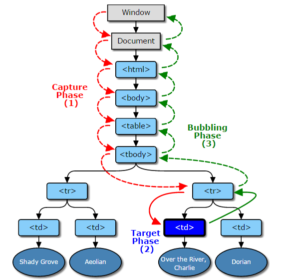
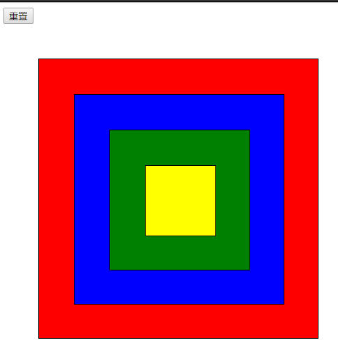

## 理解事件冒泡和委托

### 事件冒泡

由W3C规定的DOM2标准中，一次事件的完整过程包括三步：捕获→执行目标元素的监听函数→冒泡，在捕获和冒泡阶段，会依次检查途径的每个节点，如果该节点注册了相应的监听函数，则执行监听函数。

如果某个阶段不支持或事件对象的传播被终止，那么该阶段就会被跳过，举个例子，如果Event.bubbles属性被设置为false，那么冒泡阶段就会被跳过。如果Event.stopPropagation()在事件派发前被调用，那么所有的阶段都会被跳过。

一言以蔽之，事件捕获是从外层元素到目标元素的过程，事件冒泡是从目标元素到外层元素的过程。如图：



来看看一个简单的冒泡例子： http://codepen.io/daviscai/pen/VpoWpb

```
<style>
.white{background-color:#fff;}
#d1{width:400px;height:400px;border:1px solid #000;margin:50px 50px;}
#d2{width:300px;height:300px;border:1px solid #000;margin:50px 50px;}
#d3{width:200px;height:200px;border:1px solid #000;margin:50px 50px;}
#d4{width:100px;height:100px;border:1px solid #000;margin:50px 50px;}
</style>


<button id="reset1">重置</button>
<div id="d1" class="white">
    <div id="d2" class="white">
        <div id="d3" class="white">
            <div id="d4" class="white"></div>
        </div>
    </div>
</div>

<script src="https://cdn.bootcss.com/jquery/3.2.1/jquery.min.js"></script>

<script>
jQuery('#d4').click(function(){jQuery(this).css('background-color', 'yellow')});
jQuery('#d3').click(function(){jQuery(this).css('background-color', 'green')});
jQuery('#d2').click(function(){jQuery(this).css('background-color', 'blue')});
jQuery('#d1').click(function(){jQuery(this).css('background-color', 'red')});
jQuery('#reset1').click(function(){jQuery('.white').css('background-color', '#fff')});
</script>

```



点击最里面的正方形，也就是id="d4"，外层的正方形也会改变颜色，正是因为事件会往父级DOM传递，所以，外层元素的监听函数也被触发了，这个过程就是事件冒泡。

#### 事件冒泡的好处

假如有这样的需求：100行X100列的表格，点击单元格的时候，需要知道当前单元格的信息。

最笨的做法是给每个单元格绑定事件，尽管只是一个循环就搞定的事情，但性能极差，代码难于维护，有没有只绑定一次同时也能知道点击了哪个单元格的办法？ 事件冒泡可以做到

看看例子：http://codepen.io/daviscai/pen/mWNwGL

```
<style>
  table{border:1px solid #ccc;}
  table td{border:1px solid #ccc;width:50px;height:50px;}
</style>

<table id="table">
  <tr>
    <td>r1-c1</td>
    <td>r1-2</td>
    <td>r1-3</td>
  </tr>
  <tr>
    <td>r2-c1</td>
    <td>r2-2</td>
    <td>r2-3</td>
  </tr>
</table>

<div >当前点击的单元格： <span id="txt"></span> </div>

<script src="https://cdn.bootcss.com/jquery/3.2.1/jquery.min.js"></script>

<script>
$('#table').click(function(e){
  e = e || window.event;
  var target = e.target || e.srcElement;
  if(target.tagName.toLowerCase() === 'td') { // 事件冒泡会把触发该事件的event信息带过来，这样就可以判断事件来源了
    $('#txt').html(target.innerText);
  }
})

</script>
```


#### 事件冒泡的坑

事件冒泡行为在IE低版本下（IE6/IE7），事件冒泡会发生意外，通常的表现就是：
1. 事件触发了2次或者以上
2. 在IE8+以上是正常的

还有在一些加壳的客户端，由于内核是IE，在IE低版本下容易出现诡异问题，其中一个问题就是ajax异步请求发出去以后被中断了（Abort），原因是触发了2次请求，后面一次请求会把前面请求Abort。

解决办法：
1. 最简单有效的办法： 在事件监听处理函数里加上 return false 阻止冒泡
2. IE中使用cancelBubble，FF中使用stopPropation() 阻止冒泡
```
event.cancelBubble = true  // IE
event.stopPropagation()    // ff, chrome
```

可以封装成一个函数，方便调用
```
function stopBubble(e){
    //如果传入了事件对象.那么就是非IE浏览器
    if(e && e.stopPropagation){
        //因此它支持W3C的stopPropation()方法
        e.stopPropagation();
    }
    else
    {
        //否则,我们得使用IE的方式来取消事件冒泡
        window.event.cancelBubble = true;
    }
}
```

另外，blur、focus、load和unload不能像其它事件一样冒泡，所以，这些事件也就不会有冒泡带来的问题。


### 事件委托

Javascript事件委托机制是事件冒泡的典型应用之一，委托，顾名思义就是委托他人帮忙做事，把监听函数绑定到目标元素的父辈元素上，委托父辈元素来监听处理，就像上面的表格例子一样，把监听td单元格的事件绑定到table元素上。

事件委托的另一个应用场景是，监听动态插入的元素，比如jquery1.8版本下的.live()方法，可以给新增的元素绑定事件，jquery2.0已废弃了该方法，推荐用.on来实现同样的效果。

看例子，对新增的li元素绑定事件： http://codepen.io/daviscai/pen/EWqvBp 

```
<ol id="olist">
    <li>列表内容1</li>
    <li>列表内容2</li>
    <li>列表内容3</li>
    <li>列表内容4</li>
    <li>列表内容5</li>
</ol>

<a href="javascript:;" id="new-btn">新增</a>

<script>
var olist = document.getElementById('olist');
olist.addEventListener('click',function(e){
    alert(e.target.innerText);
},false);  

var btn = document.getElementById('new-btn');
btn.addEventListener('click',function(e){
    var li = document.createElement('li');
  	li.append('列表内容51');
  	olist.appendChild(li);
},false);  
 </script>
```

一句话总结： 事件委托利用事件冒泡来动态绑定事件。
