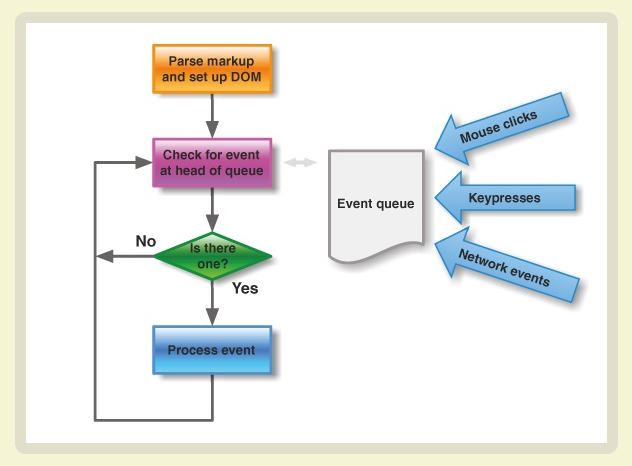

## 理解进程，线程和协程

我们都知道Node.js程序是运行在单进程，单线程环境下的，那么什么是进程？ 进程和线程的区别是什么？ 为什么node.js运行在单进程下？ node.js在单进程下为什么会获得高并发性能？

我们带着问题来看看。

### 进程
> 进程（英语：process），是计算机中已运行程序的实体。进程为曾经是分时系统的基本运作单位。程序本身只是指令、数据及其组织形式的描述，进程才是程序（那些指令和数据）的真正运行实例。
在面向线程设计的系统（如当代多数操作系统、Linux 2.6及更新的版本）中，进程本身不是基本运行单位，而是线程的容器 。  
-- 维基百科

我们首先要弄明白下面几点：
1. CPU是执行指令的地方，而内存是存储指令和数据的地方，一个CPU在同一时刻只能执行一条指令，但通过分时复用（时间共享）做到了近乎并行执行的效果，而进程/线程是指令运行的实体。
2. 一个进程包括了(拥有)运行时所需要的数据：
    1. 分配到的存储器，存储器的内容包括可运行代码、特定于进程的数据（输入、输出）、调用堆栈、堆栈信息
    2. 分配给该进程的资源的操作系统描述符，如文件描述符
    3. 进程拥有者和进程的权限集
    4. CPU状态，如寄存器内容、物理存储器定址等

3. 进程运行时，有新生（new），运行（running），等待（waiting），就绪（ready），结束（terminated）状态。`在多进程运行环境下，必然会有处于等待状态的进程。`
4. 现代操作系统是分时操作系统，资源分配的基本单位是进程，CPU调度的基本单位是线程。
5. 进程创建和管理的开销比线程大得多

另外，对应进程和线程的理解，可以看看阮一峰老师的[进程与线程的一个简单解释](http://www.ruanyifeng.com/blog/2013/04/processes_and_threads.html)，简单形象。

### 线程

> 线程（英语：thread）是操作系统能够进行运算调度的最小单位。它被包含在进程之中，是进程中的实际运作单位。同一进程中的多条线程将共享该进程中的全部系统资源，如虚拟地址空间，文件描述符和信号处理等等。但同一进程中的多个线程有各自的调用栈（call stack），自己的寄存器环境（register context），自己的线程本地存储（thread-local storage）。  
-- 维基百科

理解线程的点：
1. 进程包含线程，多个线程可以共享进程资源，意味着会有竞争，需要通过互斥锁或者信号量来防止多个线程同时读写同一块内存
2. 线程有四种基本状态，分别为：产生（spawn），中断（block），非中断（unblock），结束（finish），没有等待状态，意味着线程不需等待，要么开始执行，要么正在执行，要么执行结束
3. 多核CPU上运行线程（多线程），会有上下文切换开销，反而影响性能，因为线程是共享资源，切换核之后，线程的上下文也要被复制过去。但多进程没有这个问题。


### 协程

协程（coroutine）也叫用户级线程，简单的说就是: 线程和进程的调度是由操作系统来调控，而协程的调度由用户自己控制，由程序控制，没有上下文切换开销，也无需加锁。

协程有点像函数，又有点像线程。它的运行流程大致如下。  
第一步，协程A开始执行。  
第二步，协程A执行到一半，进入暂停，执行权转移到协程B。  
第三步，（一段时间后）协程B交还执行权。  
第四步，协程A恢复执行。  

上面流程的协程A，就是异步任务，因为它分成两段（或多段）执行。

举例来说，读取文件的协程写法如下。
```
function asnycJob() {
  // ...其他代码
  var f = yield readFile(fileA);
  // ...其他代码
}
```

上面代码的函数 asyncJob 是一个协程，它的奥妙就在其中的 yield 命令。它表示执行到此处，执行权将交给其他协程。    
协程遇到 yield 命令就暂停，等到执行权返回，再从暂停的地方继续往后执行。它的最大优点，就是代码的写法非常像同步操作。

协程的缺点是：无法利用多核资源，只能运行在一个线程里，但可以开多进程来利用多核。

协程何时挂起和唤醒？ 操作步骤为：
1. 保存当前协程的上下文（运行栈，返回地址，寄存器状态）  
2. 设置将要唤醒的协程的入口指令地址到IP寄存器  
3. 恢复将要唤醒的协程的上下文  

### Node.js为什么选择单进程，单线程？为什么不用多进程或者多线程？

首先需要了解下node.js的由来：
> 在实现 Node.js 之初，作者 Ryan Dahl 并没有选择 JavaScript，他尝试过 C、Lua，皆因其欠缺一些高级语言的特性，如闭包、函数式编程，致使程序复杂，难以维护。
而 JavaScript 则是支持函数式编程范型的语言，很好地契合了 Node.js 基于事件驱动的编程模型。加之 Google 提供的 V8 引擎，使 JavaScript 语言的执行速度大大提高。
最终呈现在我们面前的就成了 Node.js，而不是 Node.c，Node.lua 或其他语言的实现。

Node.js作者选择了用JavaScript来实现Node，而JavaScript本身就是单线程模型，这个跟早期JavaScript主要用于浏览器有关，作为浏览器脚本语言，JavaScript的主要用途是与用户互动，以及操作DOM。这决定了它只能是单线程，否则会带来很复杂的同步问题。

但是，单进程，单线程不是意味着会很容易出现等待，堵塞问题吗？怎么可以处理高并发请求？

为了解决这个问题，引入了异步I/O， 我们都知道，造成堵塞的原因一般是因为有I/O操作或者等待接口返回，那么干脆把这些耗时操作放到事件队列里，主进程继续执行，队列里事件执行完后，通过回调再回到主进程。

所以，就有2种任务，一种是同步任务（synchronous），另一种是异步任务（asynchronous）。
同步任务指的是，在主线程上排队执行的任务，只有前一个任务执行完毕，才能执行后一个任务；  
异步任务指的是，不进入主线程、而进入"事件队列"的任务，只有"事件队列"通知主线程，某个异步任务可以执行了，该任务才会进入主线程执行。

而这里又有另外一个概念：事件轮询。

通过轮询队列里的事件，判断任务是否完成，看看下面的图，当主进程空闲时，就会去读取队列里的事件，不断重复这个操作。




### node.js在单进程下为什么会获得高并发性能？

上面提到的点，基本上可以作为答案：
1. 单进程可以节省系统开销，单线程避免了锁开销和上下文切换
2. 通过异步I/O和事件驱动，可以大大提高单进程的吞吐量
3. 利用协程可以更快地处理异步操作
4. 运行在V8引擎下，性能保证

Node.js通过子进程模块或者cluster模块也可以实现多进程模式，有些情况下使用多进程未必有单进程的性能好，因为多进程创建和管理的开销比较大。

https://cnodejs.org/topic/58ddd7a303d476b42d34c911
